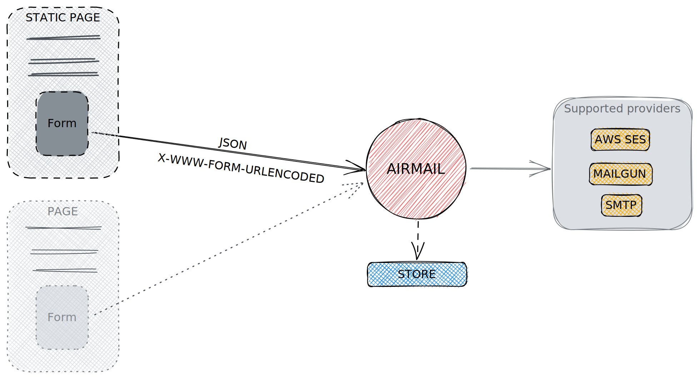

# Airmail

Airmail is a small "form service" to be used for static pages contact forms. It takes your form submission and sends it to a configured mail delivery.

Find all about installation and configuration of _Airmail_ on https://docs.viaairmail.de/.

## Development

Prerequite(s):

-   [just](https://github.com/casey/just) command runner

🗒️ You can use the development setup without using `just`. Have a look into the [`justfile`](./justfile) for individual commands.

Run `just up` in the root folder to spin up the following Docker container:

-   Airmail: the code is mirrored inside and live-reloaded via [Air](https://github.com/cosmtrek/air). Reach _Airmail_ via `http://localhost:9900`. Additionally this container also provides the local SMTP server [Mailpit](https://github.com/axllent/mailpit) reachable via `http://localhost:8025`
-   MongoDB: a container running MongoDB
-   Mongo Express: A small UI for managing MongoDB and inspecting collections reachable via `http://localhost:8888`

Happy coding fun! 🕺🏻💃🏻

## Contributing

Thank you for considering contributing. Please have a look at the [contributing guide](CONTRIBUTING.md).
